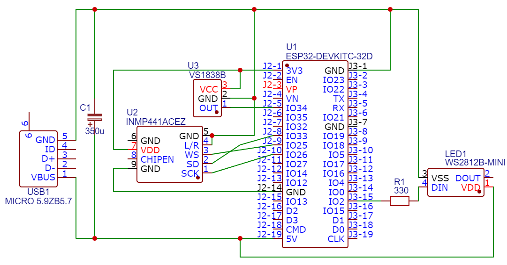

# sound-level-meter
Sound level meter for workplace with additional features

## Basic Features
* continuous measure of the sound level, use standard decibel scale
* average values from last time interval
* display warning when configured level is exceeded
* support IR remote controler for configuration and mode change
* powered by standard type A USB adapter 5V 2A

## Additional Features
* display settings (brightness, rotation, mode) and noise limit are stored to non-volatile flash memory, persist after reboot or power loss
* wifi-manager supported, when connection to last wifi settings fails, switch to Access Point mode and provide interactive web page settings on 192.168.4.1
* automatic time synchronization using Network Time Protocol with correct STD/DST time shifting for central Europe
* periodical check of new firmware versions from server and automatic download and OTA update when found

## Used hardware parts
* ESP32 WROOM development module with basic 4MB Flash, without additional PSRAM
* digital MEMS microphone module INMP441 with I2S Interface
* Flexible Led Panel WS2812B RGB matrix 8x8 pixels
* IR receiver VS1838B
* IR Remote Control BN59
* Self locking switch button 8.5 x 8.5 mm (power-on/off)
* Single row pin header strip (module sockets)
* 2 wire red-black cable 20AWG (power supply line)
* Universal double sided PCB board 8x6 cm
* Universal double sided PCB board 8x2 cm
* 6 pin IC socket (for microphone module)
* Type A Male USB 4 Pin Plug Socket Connector With Black Plastic Cover (power supply line)
* Steel Small Phillips Flat Cross Round Head Self-tapping Screw M2
* 10 pin flat color ribbon cable
* Resistor 330 Ohm 0.5W
* Aluminum Electrolytic Capacitor 330uF 6.3V

## Construction
* 3D printed case, base + lid connected together using presision snap joins (open scad files in resources directory)
* hole for power supply line
* PCBs mounted on 3d printed standoffs using screws
* PCBs electrically connected together using flat ribbon cable, soldered, no connectors
* small PCB contains sensors (microphone, IR) and power switch, peeks out through case holes
* large PCB contains microcontroller and other modules
* translucent window made from two layers of transparent foils and lawyer of white paper between foils
* led panel is fixed behind window with hotglue and connected with PCB using 3 pin wire with connector

## Schematics
